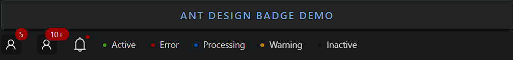

### Badge

Badge is a small status indicator or counter displayed on top of another element.

- **Components**: `Badge`
- **Types**: Numeric badge, status badge, and dot badge
- **Overflow**: Customize the maximum display value for numeric badges (e.g., `99+`)
- **Status**: Predefined status types (`success`, `error`, `default`, `processing`, `warning`)
- **Offset**: Position the badge relative to its element
- **Hidden Badge**: Hide the badge when the count is zero
- **Event Handlers**: `onClick` for badge interaction
- **Custom Content**: Supports custom content inside the badge

### Common Usage Demo



```jsx
import React from 'react';
import { Badge, Space, Avatar } from 'antd';
import { UserOutlined, BellOutlined } from '@ant-design/icons';
import "antd/dist/reset.css"; // Ant Design styles

const AntdBadgeDemo = () => {
  return (
    <div style={{ padding: '20px' }}>
      <h2>Ant Design Badge Demo</h2>

      <Space size="large">
        {/* Basic Numeric Badge */}
        <Badge count={5}>
          <Avatar shape="square" icon={<UserOutlined />} />
        </Badge>

        {/* Badge with Max Overflow */}
        <Badge count={99} overflowCount={10}>
          <Avatar shape="square" icon={<UserOutlined />} />
        </Badge>

        {/* Dot Badge */}
        <Badge dot>
          <BellOutlined style={{ fontSize: '24px' }} />
        </Badge>

        {/* Status Badge */}
        <Badge status="success" text="Active" />
        <Badge status="error" text="Error" />
        <Badge status="processing" text="Processing" />
        <Badge status="warning" text="Warning" />
        <Badge status="default" text="Inactive" />
      </Space>
    </div>
  );
};

export default AntdBadgeDemo;
```

### Features in the Demo:
1. **Numeric Badge**: Shows a count on top of another element (like an avatar).
2. **Max Overflow**: Sets a maximum display count (e.g., `10+`).
3. **Dot Badge**: Displays a small dot without a number, often used for notifications.
4. **Status Badge**: Shows predefined status indicators with labels.
5. **Customizable Badge Location**: Relatively positions the badge on its element.