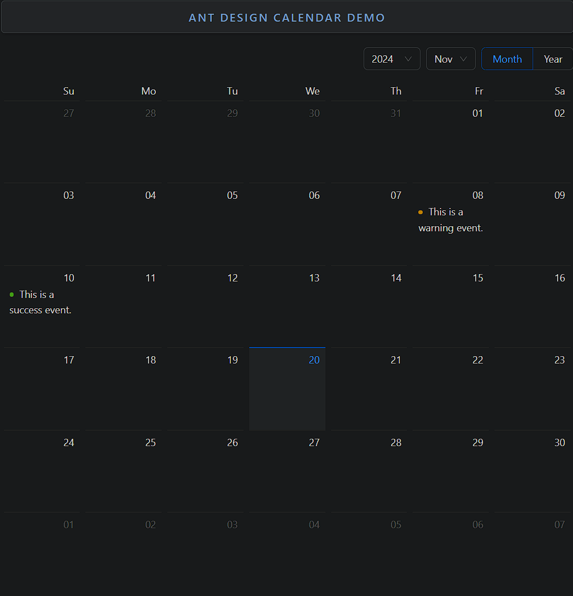

### Calendar

Calendar is a customizable and interactive calendar component for displaying and selecting dates.

- **Components**: `Calendar`
- **Modes**: Supports `month` and `year` view modes
- **Customization**: Custom date cells with rendering functions
- **Locale Support**: Automatically adapts to the current locale
- **Controlled/Uncontrolled**: Can be controlled through state or work independently
- **Event Handlers**: `onSelect`, `onPanelChange` for date and view mode changes
- **Disabled Dates**: Disable specific dates or ranges
- **Fullscreen**: Supports fullscreen or embedded mode

### Common Usage Demo



```jsx
import React, { useState } from 'react';
import { Calendar, Badge } from 'antd';
import "antd/dist/reset.css"; // Ant Design styles

const AntdCalendarDemo = () => {
  const [selectedDate, setSelectedDate] = useState(null);

  const onSelect = (date) => {
    console.log("Selected Date:", date.format('YYYY-MM-DD'));
    setSelectedDate(date);
  };

  const getListData = (value) => {
    let listData;
    switch (value.date()) {
      case 8:
        listData = [{ type: 'warning', content: 'This is a warning event.' }];
        break;
      case 10:
        listData = [{ type: 'success', content: 'This is a success event.' }];
        break;
      default:
    }
    return listData || [];
  };

  const dateCellRender = (value) => {
    const listData = getListData(value);
    return (
      <ul>
        {listData.map((item, index) => (
          <li key={index}>
            <Badge status={item.type} text={item.content} />
          </li>
        ))}
      </ul>
    );
  };

  return (
    <div style={{ padding: '20px' }}>
      <h2>Ant Design Calendar Demo</h2>

      {/* Basic Calendar with Date Selection */}
      <Calendar
        onSelect={onSelect}
        dateCellRender={dateCellRender}
      />

      {selectedDate && <p>Selected Date: {selectedDate.format('YYYY-MM-DD')}</p>}
    </div>
  );
};

export default AntdCalendarDemo;
```

### Features in the Demo:
1. **Basic Calendar**: Displays a selectable calendar with month view.
2. **Date Selection**: Logs and displays the selected date.
3. **Custom Date Cells**: Renders events using badges on specific dates.
4. **Event Handling**: Uses `onSelect` to track selected dates.
5. **Interactive UI**: Demonstrates a dynamic and customizable calendar interface.