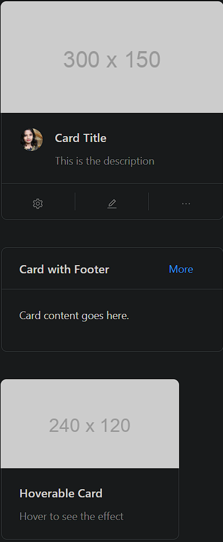

### Card

Card is a flexible and versatile container for content display.

- **Components**: `Card`
- **Header/Footer**: Supports customizable headers and footers
- **Actions**: Places action elements (e.g., buttons) at the bottom
- **Cover Image**: Displays an image or media on top of the card
- **Meta Information**: Includes title, description, and avatar using `Card.Meta`
- **Grid Layout**: Cards can be displayed in a grid format
- **Loading State**: Shows a loading placeholder for asynchronous content
- **Hoverable**: Adds a hover effect to highlight the card

### Common Usage Demo



```jsx
import React from 'react';
import { Card, Avatar, Button } from 'antd';
import { EditOutlined, EllipsisOutlined, SettingOutlined } from '@ant-design/icons';
import "antd/dist/reset.css"; // Ant Design styles

const { Meta } = Card;

const AntdCardDemo = () => {
  return (
    <div style={{ padding: '20px' }}>
      <h2>Ant Design Card Demo</h2>

      {/* Basic Card with Meta Information */}
      <Card
        style={{ width: 300 }}
        cover={}
        actions={[
          <SettingOutlined key="setting" />,
          <EditOutlined key="edit" />,
          <EllipsisOutlined key="ellipsis" />,
        ]}
      >
        <Meta
          avatar={<Avatar src="https://i.pravatar.cc/100" />}
          title="Card Title"
          description="This is the description"
        />
      </Card>

      <br /><br />

      {/* Card without Cover and with Footer */}
      <Card
        title="Card with Footer"
        extra={<Button type="link">More</Button>}
        style={{ width: 300 }}
      >
        <p>Card content goes here.</p>
      </Card>

      <br /><br />

      {/* Hoverable Card */}
      <Card
        hoverable
        style={{ width: 240 }}
        cover={}
      >
        <Meta title="Hoverable Card" description="Hover to see the effect" />
      </Card>
    </div>
  );
};

export default AntdCardDemo;
```

### Features in the Demo:
1. **Basic Card**: Displays an image with meta (title, description, and avatar).
2. **Actions**: Adds icons as action buttons.
3. **Card with Footer**: Shows a card with a custom footer (e.g., a button).
4. **Hoverable Card**: Demonstrates hoverable feature with a cover image.
5. **Customizable Layout**: Allows adding headers, footers, and content dynamically.