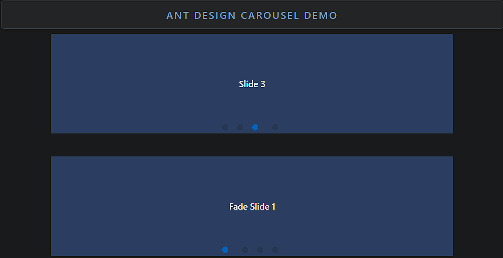

### Carousel

Carousel is a slideshow component for cycling through a series of content.

- **Components**: `Carousel`
- **Transition Type**: Supports `scrollx` (horizontal) and `fade` transition effects
- **Autoplay**: Automatically cycles through slides
- **Dots Navigation**: Displays navigation dots for quick slide access
- **Customizable Dots**: Customize the navigation dots or hide them
- **Swipe Support**: Supports swipe gestures on mobile devices
- **Controlled/Uncontrolled**: Can be controlled via state or work independently
- **Event Handlers**: `beforeChange`, `afterChange` for tracking slide transitions

### Common Usage Demo



```jsx
import React from 'react';
import { Carousel } from 'antd';
import "antd/dist/reset.css"; // Ant Design styles

const contentStyle = {
  height: '160px',
  color: '#fff',
  lineHeight: '160px',
  textAlign: 'center',
  background: '#364d79',
};

const AntdCarouselDemo = () => {
  return (
    <div style={{ padding: '20px' }}>
      <h2>Ant Design Carousel Demo</h2>

      {/* Basic Carousel */}
      <Carousel autoplay>
        <div>
          <h3 style={contentStyle}>Slide 1</h3>
        </div>
        <div>
          <h3 style={contentStyle}>Slide 2</h3>
        </div>
        <div>
          <h3 style={contentStyle}>Slide 3</h3>
        </div>
        <div>
          <h3 style={contentStyle}>Slide 4</h3>
        </div>
      </Carousel>

      <br /><br />

      {/* Carousel with Fade Effect */}
      <Carousel effect="fade">
        <div>
          <h3 style={contentStyle}>Fade Slide 1</h3>
        </div>
        <div>
          <h3 style={contentStyle}>Fade Slide 2</h3>
        </div>
        <div>
          <h3 style={contentStyle}>Fade Slide 3</h3>
        </div>
        <div>
          <h3 style={contentStyle}>Fade Slide 4</h3>
        </div>
      </Carousel>
    </div>
  );
};

export default AntdCarouselDemo;
```

### Features in the Demo:
1. **Basic Carousel**: Displays a set of slides with autoplay functionality.
2. **Custom Transition**: Demonstrates the fade transition effect.
3. **Autoplay**: Automatically cycles through slides without user interaction.
4. **Navigation Dots**: Default navigation dots for quick slide access.
5. **Responsive**: Supports swipe gestures on mobile devices for smooth interaction.