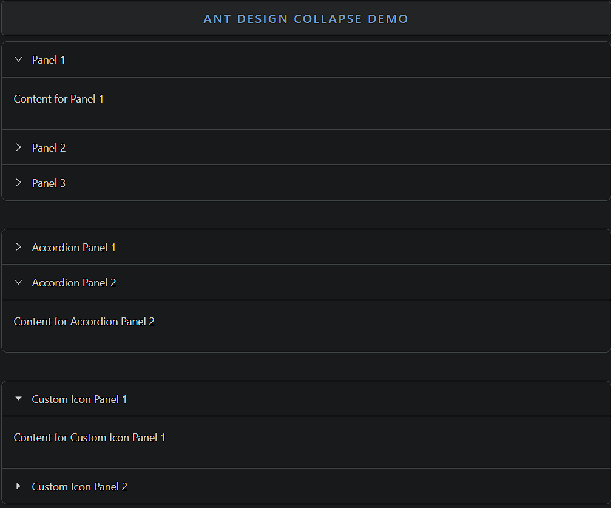

### Collapse

Collapse is a foldable panel component used to toggle visibility of content.

- **Components**: `Collapse`, `Collapse.Panel`
- **Accordion Mode**: Allows only one panel to be open at a time
- **Expand/Collapse Icons**: Customizable expand icons
- **Header Customization**: Custom headers for each panel
- **Disabled Panels**: Disable individual panels to prevent interaction
- **Collapsible**: Control whether panel/header is collapsible
- **Controlled/Uncontrolled**: Can be controlled via state or work independently
- **Event Handlers**: `onChange` handles panel toggle events

### Common Usage Demo



```jsx
import React from 'react';
import { Collapse } from 'antd';
import { CaretRightOutlined } from '@ant-design/icons';
import "antd/dist/reset.css"; // Ant Design styles

const { Panel } = Collapse;

const AntdCollapseDemo = () => {
  return (
    <div style={{ padding: '20px' }}>
      <h2>Ant Design Collapse Demo</h2>

      {/* Basic Collapse */}
      <Collapse defaultActiveKey={['1']}>
        <Panel header="Panel 1" key="1">
          <p>Content for Panel 1</p>
        </Panel>
        <Panel header="Panel 2" key="2">
          <p>Content for Panel 2</p>
        </Panel>
        <Panel header="Panel 3" key="3">
          <p>Content for Panel 3</p>
        </Panel>
      </Collapse>

      <br /><br />

      {/* Accordion Mode (One Panel at a Time) */}
      <Collapse accordion>
        <Panel header="Accordion Panel 1" key="1">
          <p>Content for Accordion Panel 1</p>
        </Panel>
        <Panel header="Accordion Panel 2" key="2">
          <p>Content for Accordion Panel 2</p>
        </Panel>
      </Collapse>

      <br /><br />

      {/* Collapse with Custom Icon */}
      <Collapse
        defaultActiveKey={['1']}
        expandIcon={({ isActive }) => <CaretRightOutlined rotate={isActive ? 90 : 0} />}
      >
        <Panel header="Custom Icon Panel 1" key="1">
          <p>Content for Custom Icon Panel 1</p>
        </Panel>
        <Panel header="Custom Icon Panel 2" key="2">
          <p>Content for Custom Icon Panel 2</p>
        </Panel>
      </Collapse>
    </div>
  );
};

export default AntdCollapseDemo;
```

### Features in the Demo:
1. **Basic Collapse**: Demonstrates basic collapsible panels.
2. **Accordion Mode**: Only one panel can be open at a time.
3. **Custom Icons**: Shows how to use custom expand/collapse icons.
4. **Controlled Panels**: Panels can be controlled via state or default keys.
5. **Collapsible Content**: Toggles visibility of nested content easily.