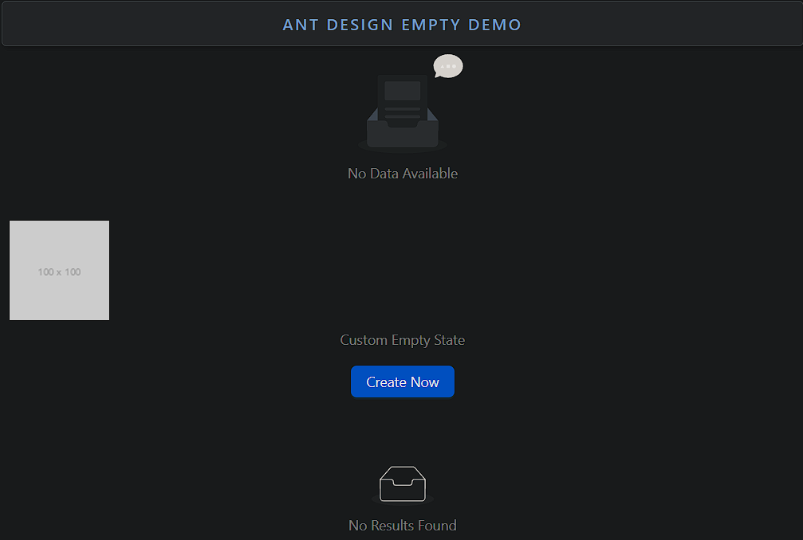

### Empty

Empty is a placeholder component used to display when no data or content is available.

- **Components**: `Empty`
- **Default Illustration**: Provides a default illustration for empty states
- **Custom Description**: Allows custom text or descriptions
- **Custom Image**: Replace the default illustration with custom images or icons
- **Hide Image**: Option to hide the illustration and only show text
- **Size Variants**: Supports different sizes for the empty state
- **Event Handlers**: `onClick` for interaction with custom content
- **Custom Content**: Can customize both the image and description

### Common Usage Demo



```jsx
import React from 'react';
import { Empty, Button } from 'antd';
import "antd/dist/reset.css"; // Ant Design styles

const AntdEmptyDemo = () => {
  return (
    <div style={{ padding: '20px' }}>
      <h2>Ant Design Empty Demo</h2>

      {/* Basic Empty Component */}
      <Empty description="No Data Available" />

      <br /><br />

      {/* Empty Component with Custom Image and Description */}
      <Empty
        image="https://via.placeholder.com/100"
        description={<span>Custom Empty State</span>}
      >
        <Button type="primary">Create Now</Button>
      </Empty>

      <br /><br />

      {/* Empty Component Without Image */}
      <Empty image={Empty.PRESENTED_IMAGE_SIMPLE} description="No Results Found" />
    </div>
  );
};

export default AntdEmptyDemo;
```

### Features in the Demo:
1. **Basic Empty State**: Displays a default "no data" message.
2. **Custom Image and Description**: Uses a custom image and description.
3. **Custom Action**: Includes a button for user interaction in the empty state.
4. **Minimal Empty State**: Demonstrates an empty component without an illustration.
5. **Custom Content**: Allows adding any custom content inside the empty placeholder.