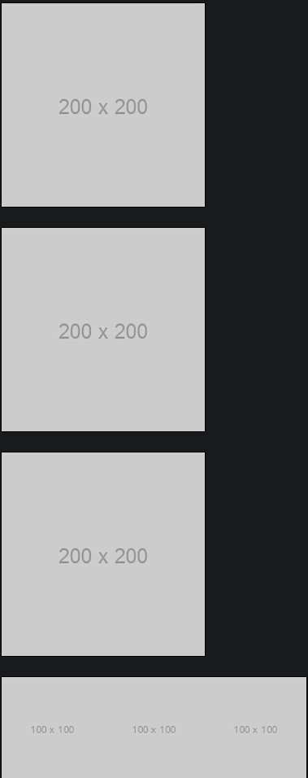

### Image

Image is a component for displaying images with additional features like previewing, fallback, and placeholders.

- **Components**: `Image`
- **Preview**: Allows users to view images in a modal fullscreen preview
- **Placeholder**: Displays a placeholder while the image is loading
- **Fallback**: Shows a fallback image when the source fails to load
- **Lazy Loading**: Supports lazy loading for performance optimization
- **Group**: Groups multiple images with a shared preview
- **Customizable**: Adjust width, height, and other styles
- **Event Handlers**: `onLoad`, `onError` for managing image load events

### Common Usage Demo



```jsx
import React from 'react';
import { Image } from 'antd';
import "antd/dist/reset.css"; // Ant Design styles

const AntdImageDemo = () => {
  return (
    <div style={{ padding: '20px' }}>
      <h2>Ant Design Image Demo</h2>

      {/* Basic Image with Preview */}
      <Image
        width={200}
        src="https://via.placeholder.com/200"
        alt="Example"
      />

      <br /><br />

      {/* Image with Fallback */}
      <Image
        width={200}
        src="https://invalid-url.com/image.jpg"
        fallback="https://via.placeholder.com/200"
        alt="Fallback Example"
      />

      <br /><br />

      {/* Image with Placeholder */}
      <Image
        width={200}
        src="https://via.placeholder.com/200"
        placeholder={<div style={{ backgroundColor: '#f0f0f0', height: '100%' }}>Loading...</div>}
        alt="Placeholder Example"
      />

      <br /><br />

      {/* Image Group with Shared Preview */}
      <Image.PreviewGroup>
        <Image width={100} src="https://via.placeholder.com/100" alt="Group 1" />
        <Image width={100} src="https://via.placeholder.com/100" alt="Group 2" />
        <Image width={100} src="https://via.placeholder.com/100" alt="Group 3" />
      </Image.PreviewGroup>
    </div>
  );
};

export default AntdImageDemo;
```

### Features in the Demo:
1. **Basic Image with Preview**: Displays an image with a built-in preview feature.
2. **Fallback Image**: Shows a fallback image if the source fails to load.
3. **Image with Placeholder**: Shows a placeholder while the image is loading.
4. **Image Preview Group**: Groups multiple images with a shared preview modal.
5. **Custom Size & Lazy Loading**: Controls image size and lazy loads for performance.