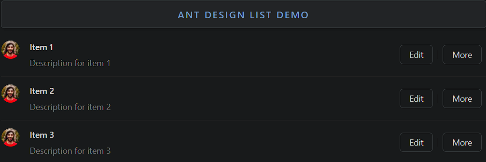

### List

List is a versatile component for displaying a collection of data in a structured format.

- **Components**: `List`
- **Data Display**: Presents data as a list of items with customizable rendering
- **Pagination**: Supports pagination for large datasets
- **Grid Layout**: Displays items in a grid format
- **Load More**: Adds a "load more" button for loading additional content
- **List Item Actions**: Allows adding action buttons (e.g., edit, delete) to each item
- **Supports Avatar**: Includes avatars or icons with list items
- **Event Handlers**: `onClick`, `onScroll` for handling interactions

### Common Usage Demo



```jsx
import React from 'react';
import { List, Avatar, Button } from 'antd';
import { MessageOutlined, LikeOutlined, StarOutlined } from '@ant-design/icons';
import "antd/dist/reset.css"; // Ant Design styles

const data = [
  {
    title: 'Item 1',
    avatar: 'https://i.pravatar.cc/40',
    description: 'Description for item 1',
  },
  {
    title: 'Item 2',
    avatar: 'https://i.pravatar.cc/40',
    description: 'Description for item 2',
  },
  {
    title: 'Item 3',
    avatar: 'https://i.pravatar.cc/40',
    description: 'Description for item 3',
  },
];

const AntdListDemo = () => {
  return (
    <div style={{ padding: '20px' }}>
      <h2>Ant Design List Demo</h2>

      {/* Basic List with Avatars and Actions */}
      <List
        itemLayout="horizontal"
        dataSource={data}
        renderItem={item => (
          <List.Item
            actions={[<Button key="list-loadmore-edit">Edit</Button>, <Button key="list-loadmore-more">More</Button>]}
          >
            <List.Item.Meta
              avatar={<Avatar src={item.avatar} />}
              title={<a href="https://ant.design">{item.title}</a>}
              description={item.description}
            />
          </List.Item>
        )}
      />

      <br /><br />

      {/* List with Grid Layout */}
      <List
        grid={{ gutter: 16, column: 3 }}
        dataSource={data}
        renderItem={item => (
          <List.Item>
            <Card title={item.title}>
              <p>{item.description}</p>
            </Card>
          </List.Item>
        )}
      />
    </div>
  );
};

export default AntdListDemo;
```

### Features in the Demo:
1. **Basic List**: Displays a list with avatars, titles, and descriptions.
2. **List Actions**: Action buttons (`Edit`, `More`) for each list item.
3. **Grid Layout**: Switches the list to a grid layout with multiple columns.
4. **Custom Item Rendering**: Uses `List.Item.Meta` for structured item rendering.
5. **Interactive Elements**: Adds clickable elements like buttons and links to each item.