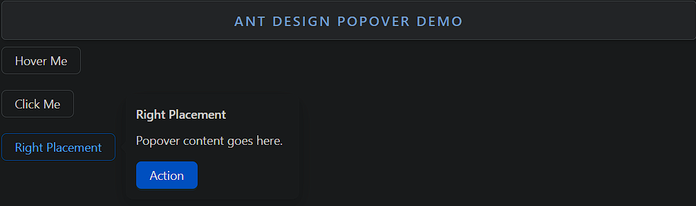

### Popover

Popover is a small overlay that displays additional content when hovering or clicking on a target element.

- **Components**: `Popover`
- **Trigger Options**: Can be triggered by `hover`, `click`, or `focus`
- **Placement**: Supports various placements (e.g., `top`, `bottom`, `left`, `right`)
- **Content Customization**: Customizable title and content
- **Arrow Pointing**: Automatically aligns the arrow towards the target
- **Controlled/Uncontrolled**: Supports both controlled and uncontrolled usage
- **Event Handlers**: `onVisibleChange` to track visibility changes
- **Closable**: Can be closed manually or automatically when clicking outside

### Common Usage Demo



```jsx
import React from 'react';
import { Popover, Button } from 'antd';
import "antd/dist/reset.css"; // Ant Design styles

const content = (
  <div>
    <p>Popover content goes here.</p>
    <Button type="primary">Action</Button>
  </div>
);

const AntdPopoverDemo = () => {
  return (
    <div style={{ padding: '20px' }}>
      <h2>Ant Design Popover Demo</h2>

      {/* Basic Popover Triggered by Hover */}
      <Popover content={content} title="Popover Title" trigger="hover">
        <Button>Hover Me</Button>
      </Popover>

      <br /><br />

      {/* Popover Triggered by Click */}
      <Popover content={content} title="Clickable Popover" trigger="click">
        <Button>Click Me</Button>
      </Popover>

      <br /><br />

      {/* Popover with Different Placement */}
      <Popover content={content} title="Right Placement" placement="right">
        <Button>Right Placement</Button>
      </Popover>
    </div>
  );
};

export default AntdPopoverDemo;
```

### Features in the Demo:
1. **Basic Popover**: Shows content on hover with a title.
2. **Clickable Popover**: Triggered by clicking the target element.
3. **Custom Placement**: Demonstrates a popover positioned to the right of the button.
4. **Custom Content**: Popover contains both text and actionable buttons.
5. **Flexible Triggers**: Supports different trigger types (`hover`, `click`).