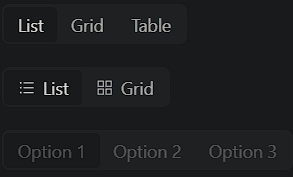

### Segmented

Segmented is a compact control for toggling between multiple options, similar to a button group or tabs.

- **Components**: `Segmented`
- **Options**: Supports text, icons, or both as options
- **Sizes**: Available in small, default, and large sizes
- **Disabled State**: Individual options or the entire control can be disabled
- **Customizable**: Supports custom labels, icons, and values
- **Controlled/Uncontrolled**: Can manage selected value via state or work independently
- **Event Handlers**: `onChange` to track option selection
- **Responsive**: Adapts to different screen sizes

### Common Usage Demo



```jsx
import React, { useState } from 'react';
import { Segmented } from 'antd';
import "antd/dist/reset.css"; // Ant Design styles
import { AppstoreOutlined, BarsOutlined } from '@ant-design/icons';

const AntdSegmentedDemo = () => {
  const [selected, setSelected] = useState("List");

  const handleChange = (value) => {
    console.log("Selected:", value);
    setSelected(value);
  };

  return (
    <div style={{ padding: '20px' }}>
      <h2>Ant Design Segmented Demo</h2>

      {/* Basic Segmented Control */}
      <Segmented
        options={['List', 'Grid', 'Table']}
        onChange={handleChange}
        defaultValue="List"
      />

      <br /><br />

      {/* Segmented Control with Icons */}
      <Segmented
        options={[
          { label: 'List', value: 'list', icon: <BarsOutlined /> },
          { label: 'Grid', value: 'grid', icon: <AppstoreOutlined /> },
        ]}
        onChange={handleChange}
        value={selected}
      />

      <br /><br />

      {/* Disabled Segmented Control */}
      <Segmented
        options={['Option 1', 'Option 2', 'Option 3']}
        disabled
      />
    </div>
  );
};

export default AntdSegmentedDemo;
```

### Features in the Demo:
1. **Basic Segmented Control**: Toggle between different views (e.g., List, Grid, Table).
2. **Segmented with Icons**: Uses icons alongside labels for a more visual toggle.
3. **Disabled Segmented Control**: Demonstrates a disabled state where options cannot be selected.
4. **Event Handling**: Tracks and logs changes on option selection.
5. **Responsive**: Adjusts seamlessly across different screen sizes.