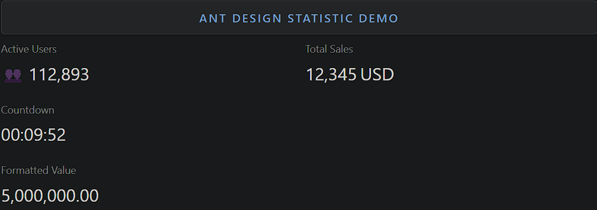

### Statistic

Statistic is a component for displaying numerical values with formatting and styling.

- **Components**: `Statistic`, `Statistic.Countdown`
- **Precision**: Supports number formatting with custom precision
- **Prefix/Suffix**: Allows adding text, icons, or symbols before/after the value
- **Countdown**: Displays a countdown timer until a specific target time
- **Value Formatting**: Supports custom number formatting (e.g., thousands separator)
- **Title**: Includes a title to describe the statistic
- **Style Customization**: Fully customizable text styling (e.g., colors, size)
- **Event Handlers**: For countdown (`onFinish`) event handling

### Common Usage Demo



```jsx
import React from 'react';
import { Statistic, Row, Col, Button } from 'antd';
import "antd/dist/reset.css"; // Ant Design styles

const AntdStatisticDemo = () => {
  const deadline = Date.now() + 1000 * 60 * 10; // 10 minutes from now

  return (
    <div style={{ padding: '20px' }}>
      <h2>Ant Design Statistic Demo</h2>

      <Row gutter={16}>
        {/* Basic Statistic with Prefix */}
        <Col span={12}>
          <Statistic title="Active Users" value={112893} prefix="👥" />
        </Col>

        {/* Statistic with Suffix */}
        <Col span={12}>
          <Statistic title="Total Sales" value={12345} suffix="USD" />
        </Col>
      </Row>

      <br />

      {/* Countdown Timer */}
      <Row gutter={16}>
        <Col span={12}>
          <Statistic.Countdown title="Countdown" value={deadline} onFinish={() => alert('Countdown finished!')} />
        </Col>
      </Row>

      <br />

      {/* Statistic with Formatting */}
      <Row gutter={16}>
        <Col span={12}>
          <Statistic title="Formatted Value" value={5000000} precision={2} />
        </Col>
      </Row>
    </div>
  );
};

export default AntdStatisticDemo;
```

### Features in the Demo:
1. **Basic Statistic with Prefix**: Displays a statistic with a user icon prefix.
2. **Statistic with Suffix**: Shows numerical data with a currency suffix.
3. **Countdown Timer**: Implements a countdown timer with an alert on finish.
4. **Formatted Statistic**: Demonstrates custom number formatting with precision.
5. **Customizable Layout**: Uses `Row` and `Col` for responsive, structured statistics.