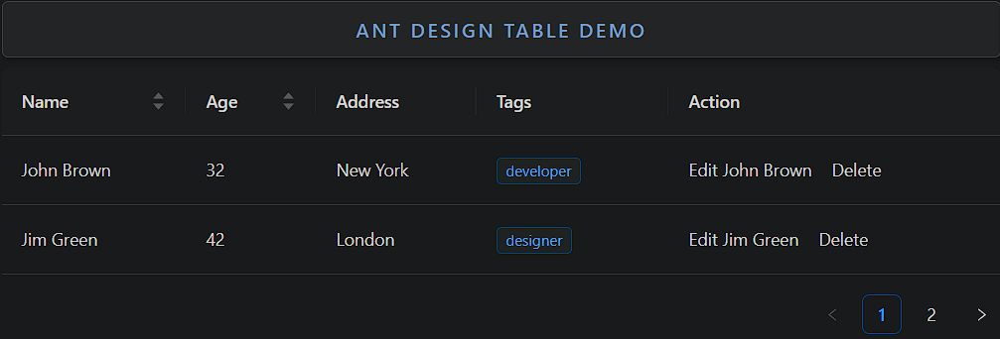

### Table

Table is a component for displaying structured data in rows and columns.

- **Components**: `Table`
- **Columns and Data**: Define custom columns and data sources
- **Sorting**: Supports sorting by column
- **Filtering**: Allows filtering data by column
- **Pagination**: Handles large datasets with built-in pagination
- **Expandable Rows**: Expand rows to show additional content
- **Editable Cells**: Provides editable cells for inline editing
- **Row Selection**: Allows selection of multiple rows
- **Custom Render**: Custom rendering for cells, headers, and footers

### Common Usage Demo



```jsx
import React, { useState } from 'react';
import { Table, Tag, Space } from 'antd';
import "antd/dist/reset.css"; // Ant Design styles

const AntdTableDemo = () => {
  // Define table columns
  const columns = [
    {
      title: 'Name',
      dataIndex: 'name',
      key: 'name',
      sorter: (a, b) => a.name.localeCompare(b.name),
    },
    {
      title: 'Age',
      dataIndex: 'age',
      key: 'age',
      sorter: (a, b) => a.age - b.age,
    },
    {
      title: 'Address',
      dataIndex: 'address',
      key: 'address',
    },
    {
      title: 'Tags',
      key: 'tags',
      dataIndex: 'tags',
      render: (_, { tags }) => (
        <>
          {tags.map(tag => (
            <Tag color="blue" key={tag}>
              {tag}
            </Tag>
          ))}
        </>
      ),
    },
    {
      title: 'Action',
      key: 'action',
      render: (_, record) => (
        <Space size="middle">
          <a>Edit {record.name}</a>
          <a>Delete</a>
        </Space>
      ),
    },
  ];

  // Define table data
  const data = [
    {
      key: '1',
      name: 'John Brown',
      age: 32,
      address: 'New York',
      tags: ['developer'],
    },
    {
      key: '2',
      name: 'Jim Green',
      age: 42,
      address: 'London',
      tags: ['designer'],
    },
    {
      key: '3',
      name: 'Joe Black',
      age: 32,
      address: 'Sydney',
      tags: ['teacher'],
    },
  ];

  return (
    <div style={{ padding: '20px' }}>
      <h2>Ant Design Table Demo</h2>

      {/* Basic Table with Sorting and Tags */}
      <Table columns={columns} dataSource={data} pagination={{ pageSize: 2 }} />
    </div>
  );
};

export default AntdTableDemo;
```

### Features in the Demo:
1. **Basic Table**: Displays data in a structured format with columns and rows.
2. **Sorting**: Enables sorting by name and age columns.
3. **Tags Rendering**: Shows how to render tags inside table cells.
4. **Action Buttons**: Provides action buttons (e.g., edit and delete) for each row.
5. **Pagination**: Handles large datasets with pagination (2 rows per page).