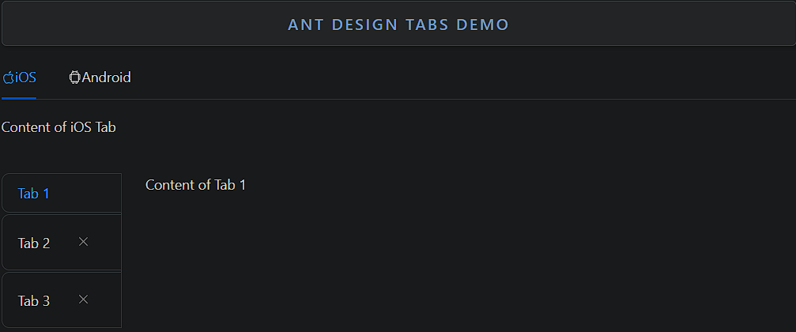

### Tabs

Tabs is a component used to organize and navigate content by switching between different views.

- **Components**: `Tabs`, `TabPane`
- **Tab Position**: Supports top, bottom, left, and right tab positioning
- **Animated Transitions**: Includes animated transitions when switching between tabs
- **Customizable Tabs**: Allows custom tab labels (text, icons, components)
- **Disabled Tabs**: Option to disable specific tabs
- **Controlled/Uncontrolled**: Can be controlled via state or work independently
- **Closable Tabs**: Option to add close buttons for removable tabs
- **Event Handlers**: `onChange`, `onTabClick` for tab interactions

### Common Usage Demo



```jsx
import React, { useState } from 'react';
import { Tabs } from 'antd';
import { AppleOutlined, AndroidOutlined } from '@ant-design/icons';
import "antd/dist/reset.css"; // Ant Design styles

const { TabPane } = Tabs;

const AntdTabsDemo = () => {
  const [activeKey, setActiveKey] = useState("1");

  const handleTabChange = (key) => {
    console.log("Selected Tab:", key);
    setActiveKey(key);
  };

  return (
    <div style={{ padding: '20px' }}>
      <h2>Ant Design Tabs Demo</h2>

      {/* Basic Tabs with Icons */}
      <Tabs defaultActiveKey="1" onChange={handleTabChange}>
        <TabPane
          tab={
            <span>
              <AppleOutlined />
              iOS
            </span>
          }
          key="1"
        >
          Content of iOS Tab
        </TabPane>
        <TabPane
          tab={
            <span>
              <AndroidOutlined />
              Android
            </span>
          }
          key="2"
        >
          Content of Android Tab
        </TabPane>
      </Tabs>

      <br /><br />

      {/* Tabs with Custom Position and Closable */}
      <Tabs
        activeKey={activeKey}
        onChange={handleTabChange}
        tabPosition="left"
        type="editable-card"
        hideAdd
      >
        <TabPane tab="Tab 1" key="1" closable={false}>
          Content of Tab 1
        </TabPane>
        <TabPane tab="Tab 2" key="2">
          Content of Tab 2
        </TabPane>
        <TabPane tab="Tab 3" key="3">
          Content of Tab 3
        </TabPane>
      </Tabs>
    </div>
  );
};

export default AntdTabsDemo;
```

### Features in the Demo:
1. **Basic Tabs with Icons**: Displays tabs with text and icons (e.g., iOS and Android).
2. **Custom Tab Position**: Places tabs on the left side of the content.
3. **Closable Tabs**: Demonstrates tabs that can be closed by the user.
4. **Controlled Tabs**: Shows how to control the active tab using state.
5. **Event Handling**: Logs changes when switching between tabs via `onChange`.