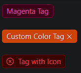

### Tag

Tag is a compact, colored label used to categorize or highlight items.

- **Components**: `Tag`
- **Preset Colors**: Offers predefined color options (e.g., `success`, `warning`)
- **Custom Colors**: Allows custom colors using HEX, RGB, or HSL values
- **Closable**: Option to add a close button for removable tags
- **Icon Support**: Can include icons inside tags
- **Animations**: Includes smooth close animations
- **Event Handlers**: `onClose`, `onClick` for interaction tracking

### Common Usage Demo



```jsx
import React, { useState } from 'react';
import { Tag, CheckableTag } from 'antd';
import { CloseCircleOutlined } from '@ant-design/icons';
import "antd/dist/reset.css"; // Ant Design styles

const AntdTagDemo = () => {
  const [checked, setChecked] = useState(false);

  const handleClose = (e) => {
    console.log('Tag closed');
  };

  const handleCheckChange = (checked) => {
    setChecked(checked);
  };

  return (
    <div style={{ padding: '20px' }}>
      <h2>Ant Design Tag Demo</h2>

      {/* Basic Tag with Preset Color */}
      <Tag color="magenta">Magenta Tag</Tag>

      <br /><br />

      {/* Closable Tag with Custom Color */}
      <Tag color="#f50" closable onClose={handleClose}>
        Custom Color Tag
      </Tag>

      <br /><br />

      {/* Tag with Icon */}
      <Tag icon={<CloseCircleOutlined />} color="red">
        Tag with Icon
      </Tag>
    </div>
  );
};

export default AntdTagDemo;
```

### Features in the Demo:
1. **Basic Tag**: Displays a tag with a preset color (`magenta`).
2. **Closable Tag**: Demonstrates a tag that can be closed with a close button.
3. **Tag with Icon**: Includes an icon inside the tag (e.g., close icon).
5. **Custom Colors**: Uses custom color values for tags.