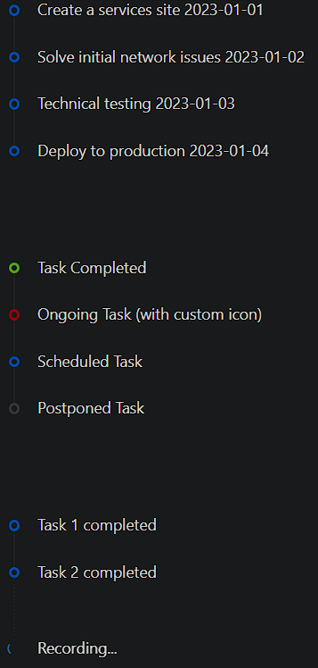

### Timeline

Timeline is a vertical list used to display a sequence of events or steps in chronological order.

- **Components**: `Timeline`, `Timeline.Item`
- **Custom Icons**: Supports custom icons for each timeline item
- **Color**: Allows setting colors for items (`blue`, `red`, `green`, etc.)
- **Pending State**: Displays a pending state for ongoing tasks or future events
- **Reverse Order**: Can display items in reverse order
- **Alternate Layout**: Staggers items on both sides for a more dynamic layout
- **Event Handlers**: `onClick` for interaction with timeline items

### Common Usage Demo



```jsx
import React from 'react';
import { Timeline } from 'antd';
import { ClockCircleOutlined } from '@ant-design/icons';
import "antd/dist/reset.css"; // Ant Design styles

const AntdTimelineDemo = () => {
  return (
    <div style={{ padding: '20px' }}>
      <h2>Ant Design Timeline Demo</h2>

      {/* Basic Timeline */}
      <Timeline>
        <Timeline.Item>Create a services site 2023-01-01</Timeline.Item>
        <Timeline.Item>Solve initial network issues 2023-01-02</Timeline.Item>
        <Timeline.Item>Technical testing 2023-01-03</Timeline.Item>
        <Timeline.Item>Deploy to production 2023-01-04</Timeline.Item>
      </Timeline>

      <br /><br />

      {/* Timeline with Custom Icons and Colors */}
      <Timeline>
        <Timeline.Item color="green">Task Completed</Timeline.Item>
        <Timeline.Item color="red" icon={<ClockCircleOutlined />}>
          Ongoing Task (with custom icon)
        </Timeline.Item>
        <Timeline.Item color="blue">Scheduled Task</Timeline.Item>
        <Timeline.Item color="gray">Postponed Task</Timeline.Item>
      </Timeline>

      <br /><br />

      {/* Timeline with Pending Item */}
      <Timeline pending="Recording...">
        <Timeline.Item>Task 1 completed</Timeline.Item>
        <Timeline.Item>Task 2 completed</Timeline.Item>
      </Timeline>
    </div>
  );
};

export default AntdTimelineDemo;
```

### Features in the Demo:
1. **Basic Timeline**: Displays a simple sequence of events.
2. **Custom Icons and Colors**: Customizes timeline items with different colors and icons.
3. **Pending State**: Shows a pending item for future or ongoing tasks.
4. **Dynamic Layout**: Demonstrates timeline flexibility with color-coding and icons.