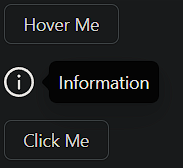

### Tooltip

Tooltip is a lightweight overlay used to display additional information when users hover, click, or focus on a target element.

- **Components**: `Tooltip`
- **Trigger Options**: Can be triggered by `hover`, `click`, or `focus`
- **Placement**: Supports multiple placements like `top`, `bottom`, `left`, `right`
- **Delay**: Configurable display delay for showing/hiding the tooltip
- **Arrow Pointing**: Automatically aligns the arrow towards the target
- **Custom Content**: Supports custom content, including text, icons, or JSX
- **Event Handlers**: `onVisibleChange` to track tooltip visibility changes
- **Controlled/Uncontrolled**: Can be controlled via state or work independently

### Common Usage Demo



```jsx
import React, { useState } from 'react';
import { Tooltip, Button } from 'antd';
import { InfoCircleOutlined } from '@ant-design/icons';
import "antd/dist/reset.css"; // Ant Design styles

const AntdTooltipDemo = () => {
  const [visible, setVisible] = useState(false);

  const handleVisibleChange = (newVisible) => {
    setVisible(newVisible);
  };

  return (
    <div style={{ padding: '20px' }}>
      <h2>Ant Design Tooltip Demo</h2>

      {/* Basic Tooltip */}
      <Tooltip title="This is a tooltip">
        <Button>Hover Me</Button>
      </Tooltip>

      <br /><br />

      {/* Tooltip with Custom Icon and Placement */}
      <Tooltip title="Information" placement="right">
        <InfoCircleOutlined style={{ fontSize: '24px' }} />
      </Tooltip>

      <br /><br />

      {/* Controlled Tooltip */}
      <Tooltip
        title="Controlled Tooltip"
        visible={visible}
        onVisibleChange={handleVisibleChange}
      >
        <Button>Click Me</Button>
      </Tooltip>
    </div>
  );
};

export default AntdTooltipDemo;
```

### Features in the Demo:
1. **Basic Tooltip**: Displays a tooltip when hovering over a button.
2. **Custom Placement**: Positions the tooltip to the right of an icon.
3. **Controlled Tooltip**: Manages the tooltip’s visibility via state.
4. **Custom Content**: Demonstrates tooltips with text and icons.
5. **Flexible Triggers**: Can be triggered by different user interactions (hover, click).