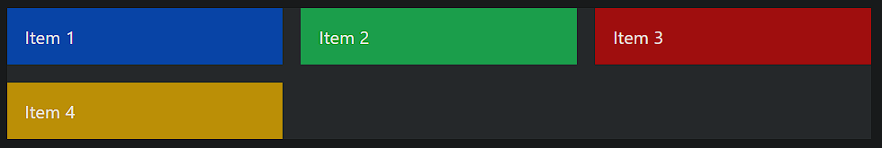

### Grid Auto Flow in TailwindCSS

- **Grid Auto Flow**: TailwindCSS provides utilities to control the automatic placement of grid items when the grid layout doesn't explicitly define their positions. This is managed by the `grid-auto-flow` CSS property, which determines how items are placed in the grid:
  - **`grid-flow-row`**: Places items row by row (default).
  - **`grid-flow-col`**: Places items column by column.
  - **`grid-flow-row-dense`** and **`grid-flow-col-dense`**: Fills gaps in the grid more tightly by attempting to place items in the smallest available spaces.

> **Grid Auto Flow**：TailwindCSS 提供了一组工具类，用于控制当网格布局未显式定义项目位置时，如何自动排列网格项目。这通过 `grid-auto-flow` 属性实现，决定项目在网格中的排列方式：
> - **`grid-flow-row`**：按行排列项目（默认）。
> - **`grid-flow-col`**：按列排列项目。
> - **`grid-flow-row-dense`** 和 **`grid-flow-col-dense`**：通过尝试将项目放置在最小的空隙中，更紧密地填充网格。

#### Example:



```html
<div class="grid grid-cols-3 grid-flow-row gap-4 bg-gray-200">
  <div class="bg-blue-500 p-4">Item 1</div>
  <div class="bg-green-500 p-4">Item 2</div>
  <div class="bg-red-500 p-4">Item 3</div>
  <div class="bg-yellow-500 p-4">Item 4</div>
</div>
```

In this example, `grid-flow-row` arranges the items row by row. If you change it to `grid-flow-col`, the items will be placed column by column.

> 
>
> grid-rows-3 grid-flow-col